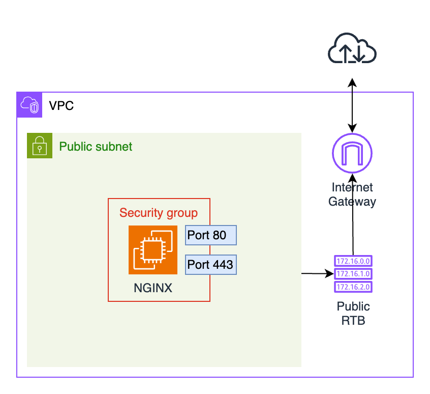
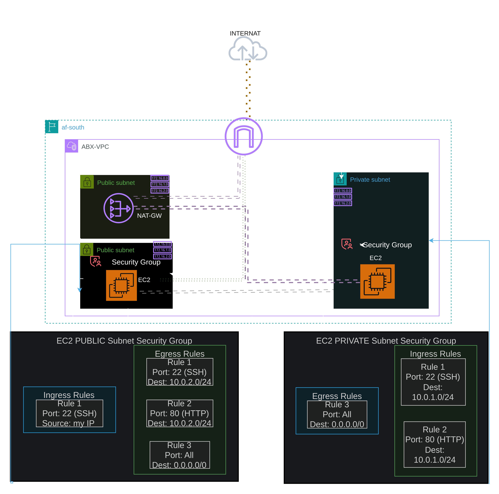

creating login key pair for instance.(on linux)
    >use the command "ssh-keygen -t rsa -b 4096 -f ~/.ssh/aws_key_pair" to create the key

    >PRESS ENTER TWICE When prompted for a passphrase for auto-login testing or enter a secure password.

    >confirm both public and prite  key exist "ls -la ~/.ssh/"
    >we will submit "__ .pub" key to aws IN THE EC2_ACCESS FILE and we keep the privete key for ssh to the in stance 

    >SSH will reject private keys if their permissions are too open. Run these commands to set the standard secure file permissions:

            Bash
            chmod 700 ~/.ssh && chmod 600 ~/.ssh/aws_key && chmod 644 ~/.ssh/aws_key.pub
    
    > in the ec2_access file , we3c will use pathexpand() function to  turns ~/.ssh/aws_key_pair.pub into my/your computer file path to public e.g /Users/username/.ssh/aws_key_pair.pub automatically.To avoid typing the whole path ourself

    <>to ssh in to our machines Once Terraform provisions your EC2 instance, SSH will automatically look in your ~/.ssh/ folder by default, so you don't even need to pass the -i flag:

            Bash
            ssh -i ubuntu@<YOUR_INSTANCE_PUBLIC_IP>

            use terraform output to get the ip addresses

                        !!!DELETE THE KEYS AFTER DETELING THE RESOURCE!!!

